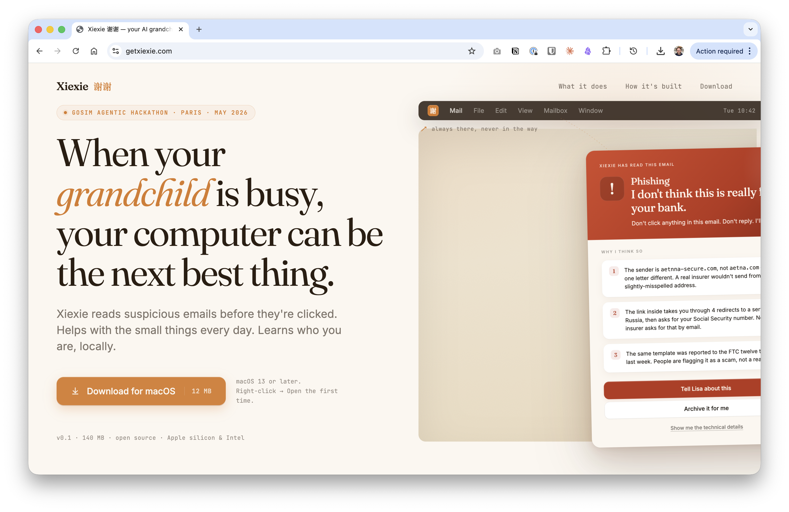

# Xiexie 谢谢 — your AI grandchild



A voice-first macOS companion that protects seniors from email scams,
reads their screen out loud, and points at things they can't find.
Forked from [Farza's Clicky](https://github.com/farzaa/clicky) (MIT)
and re-tuned end-to-end for **Z.AI's GLM-4.6 + GLM-4.5V**.

Live: **[getxiexie.com](https://getxiexie.com)** · Demo video: **[getxiexie.com/demo](https://getxiexie.com/demo)**

Built in 36 hours at the **GOSIM 2026 Agentic Hackathon** (Paris,
May 5–6) for the **Z.AI Innovation track**. The demo persona is
**Michel Antoine**, 78, retired in Anglet, France, who lives alone
since his wife passed two years ago. His daughter Sophie lives in
London. Most days, the riskiest thing on his computer is the next
email pretending to be the *Caisse Primaire d'Assurance Maladie*.

> "When your grandchild is busy, your computer can be the next best
> thing. Just say… *Xiexie*."

---

## What it does

**Hold Control + Option** anywhere on macOS to talk to Xiexie. Release
to send. Xiexie sees your screen, hears you, replies via warm voice,
and can fly an ember-orange cursor to specific UI elements you should
look at — including the suspicious link inside a phishing email.

The flagship beat is the **scam shield**. When Michel asks
*"Is this email a scam?"*, GLM-4.5V reads the Mail.app screenshot,
spots the typosquat domain, the SPF/DMARC mismatch, the urgency-and-
fear language, and replies in Michel's voice:

> *"Michel, this is a scam. The sender pretends to be the CPAM but
> the address ends in `.ru` — that's Russia. Don't click, don't
> reply. If you're worried about your Carte Vitale, call the number
> printed on the card itself."*

…then the cursor flies to the suspicious link with a label that says
*the fake link*, in 20 pt so Michel sees it from across the kitchen.

[Demo video coming.]

---

## What's different from upstream Clicky

| Layer | Clicky | Xiexie |
|---|---|---|
| LLM orchestrator | Anthropic Claude Sonnet 4.6 | **Z.AI GLM-4.6** (text) + **GLM-4.5V** (vision, auto-routed) |
| Worker proxy | direct passthrough to Anthropic | **Anthropic ↔ OpenAI translator**: Swift app's payload format unchanged, Worker rewrites to Z.AI ChatCompletions and re-emits the upstream OpenAI SSE as Anthropic events |
| Persona | "AI teacher" for general computer help | "AI grandchild" for a 78-year-old, scam-shield as the top mission |
| UI scale | tuned for millennials | every cursor + label + waveform 2.25× larger; panel 1.6× wider; ember warm palette instead of tech-blue |
| Wake | only Ctrl+Option push-to-talk | Ctrl+Option *and* a custom-trained openWakeWord ONNX for *"Xiexie"* (training pipeline + 944 user recordings ship in `training/wakeword/` — runtime integration on `feat/wakeword-realtime`, in flight) |
| Demo data | none | six RFC822 `.eml` fixtures of currently-active 2026 European scam patterns, drag-droppable into Mail.app for the judging panel |

The Swift code change for the LLM swap is one line — the heavy lifting
is in the Worker (`worker/src/index.ts`). That keeps the upstream Clicky
codebase the source of truth on everything voice + cursor + screen
capture, and isolates Xiexie's contributions as a small, reviewable diff.

---

## Setup (15 minutes from a fresh Mac)

### Prerequisites

- macOS 14.2+ (for ScreenCaptureKit)
- Xcode 15+ — App Store
- Node.js 18+ — `brew install node`
- A free Cloudflare account
- Three API keys (all have free tiers; combined ≈ €0 for a few demos):
  - **Z.AI** — https://docs.z.ai/api-reference/introduction
  - **AssemblyAI** — https://www.assemblyai.com/app/account/keys (streaming STT)
  - **ElevenLabs** — https://elevenlabs.io/app/settings/api-keys (warm TTS)

### Clone + Worker

```bash
git clone https://github.com/edouardfoussier/gosim-hackathon.git xiexie
cd xiexie
git checkout feat/clicky-fork

cd worker
cp .dev.vars.example .dev.vars
# Edit .dev.vars and paste the three keys.
npm install
npx wrangler dev
```

Wrangler runs the Worker locally at `http://127.0.0.1:8787`. Leave that
terminal open for the rest of the session.

### Build the Mac app

```bash
open leanring-buddy.xcodeproj
```

In Xcode:

1. Select the `leanring-buddy` scheme (yes, the typo's intentional —
   Clicky's original project name was *Learning Buddy*; we keep the
   path so the upstream patch surface stays small)
2. Signing & Capabilities → set your Team (a free Apple ID is fine for
   local builds)
3. Cmd+R

The app installs in the menu bar (no Dock icon, no Cmd-Tab entry). Click
the tray icon, grant the four permission prompts (Microphone,
Accessibility, Screen Recording, Screen Content), and you're live.

### Drop the demo emails into Mail.app (optional, for the scam-shield path)

```bash
cd data/demo/eml
python3 build_mbox.py
# Then in Mail.app: File → Import Mailboxes → Files in mbox format
# → select data/demo/eml/ → Continue → drag the imports into your Inbox.
```

`data/demo/eml/README.md` has the full recipe + an `osascript` to mark
all six unread in one shot.

---

## Architecture

```
                ┌──────────────────────────┐
                │  Xiexie.app (Swift)      │
                │  • menu bar panel        │
                │  • ScreenCaptureKit      │
                │  • ⌃⌥ push-to-talk       │
                │  • ember cursor overlay  │
                │  • [POINT:x,y] pointing  │
                └────────────┬─────────────┘
                             │ HTTP / WS
                             ▼
                ┌──────────────────────────┐
                │  Cloudflare Worker        │
                │  • /chat (LLM)           │
                │  • /tts (TTS)            │
                │  • /transcribe-token     │
                └──┬──────────┬──────────┬─┘
                   │          │          │
        ┌──────────┘          │          └──────────┐
        ▼                     ▼                     ▼
  Z.AI GLM-4.6           ElevenLabs            AssemblyAI
  Z.AI GLM-4.5V             (TTS)            (streaming STT)
  (auto-routed
   on image input)
```

The Worker's `/chat` route is the only non-trivial piece. It accepts the
Mac app's existing Anthropic Messages payload, walks the content blocks,
translates `image/source/base64` to OpenAI's `image_url/data:` form,
forwards to Z.AI's OpenAI-compatible endpoint with `thinking: { type:
"disabled" }` (otherwise GLM-4.6's chain-of-thought prefix burns the
token budget before the actual reply lands), and re-emits the OpenAI
SSE stream back to Swift as Anthropic-shaped `content_block_delta`
events. The Mac app stays unchanged on the LLM seam.

---

## Project structure

```
leanring-buddy/                  # Swift sources (typo kept from Clicky)
  CompanionManager.swift           # Central state machine
  CompanionPanelView.swift         # Menu bar panel UI (Xiexie-rebranded)
  ClaudeAPI.swift                  # LLM streaming client (now talks to Z.AI via Worker)
  ElevenLabsTTSClient.swift        # Text-to-speech playback
  OverlayWindow.swift              # Ember cursor + 2.25× labels (was 1× blue)
  AssemblyAI*.swift                # Real-time transcription
  BuddyDictation*.swift            # Push-to-talk pipeline
  DesignSystem.swift               # Color tokens — ember palette overrides Clicky's blue scale
  Assets.xcassets/                 # Ember-recolored AppIcon (was Clicky's blue triangle)
worker/
  src/index.ts                     # Anthropic ↔ Z.AI/OpenAI translator
  wrangler.toml                    # Public vars (model names, voice ID)
  .dev.vars.example                # Template for the three secret keys
data/
  demo/eml/                        # Six 2026 European scam .eml fixtures
  wiki/                            # Michel Antoine persona seed
training/wakeword/                 # openWakeWord training pipeline + Colab notebook
                                   # — produces xiexie.onnx (13.7 KB) for the
                                   # always-on "Xiexie" wake word path on
                                   # branch feat/wakeword-realtime
docs/demo-runthrough.md            # Solo rehearsal recipe + 5-min judging storyboard
AGENTS.md                          # Original Clicky architecture doc (kept verbatim)
XIEXIE_SETUP.md                    # Xiexie-specific setup notes
XIEXIE_LEGACY.md                   # Pre-fork engineering log (decisions, ADRs)
```

---

## Built for GOSIM 2026 — Z.AI Innovation track

We targeted the rubric's four 20%-weight columns honestly:

- **Innovation** — The judging-floor signature is the
  scam-shield narrative for seniors. Forty-six other teams registered
  and zero of them target elder protection on macOS. The framing — *"AI
  grandchild that protects, remembers, and never sleeps"* — is the
  moat, not the tech stack underneath it.
- **Technical depth** — End-to-end: a custom-trained openWakeWord
  ONNX classifier (`training/wakeword/xiexie_wakeword_training.ipynb`),
  a Cloudflare Worker that translates two LLM API contracts in
  streaming SSE, GLM-4.5V vision routed automatically by the same
  Worker on image-bearing requests, and a Karpathy LLM-Wiki memory
  pattern in `data/wiki/` so the agent's context grows after each
  conversation.
- **Practicality** — The fork strategy itself is the practicality
  beat: rather than build a Mac app from scratch in 36 hours, we forked
  Clicky's MIT-licensed shell, rebranded the surfaces a senior actually
  sees, and swapped the LLM seam. That gave us a real `.app` with
  ScreenCaptureKit, global push-to-talk, multi-monitor cursor pointing,
  and Cmd-Q lifecycle on day one — features that would have eaten the
  whole hackathon to rebuild.
- **Presentation** — The demo lives or dies on one beat:
  Michel asks *"is this email a scam?"* about a real-looking CPAM
  phishing fixture, GLM-4.5V reads the screen, and the ember cursor
  flies to the fake link with a 20 pt label. We optimised the build
  for that one moment landing reliably.

We're a one-person team. There's a long list of follow-on work
(`feat/wakeword-realtime` is in flight as we write this; the wiki
linter pipeline isn't running yet; the French dub-track on the demo
prompt is hand-tuned, not data-driven). Treat this README as a
checkpoint, not a finished product.

---

## Credits + license

This project is a fork of [Clicky by Farza](https://github.com/farzaa/clicky)
and inherits its **MIT license** verbatim. Every Swift source file in
`leanring-buddy/` is a derivative of Clicky; please give Farza credit
if you build on top.

The Xiexie persona, the scam-shield system prompt, the Worker LLM
translator, the ember palette, the senior-scale UI, the
openWakeWord-Xiexie training pipeline, and the European demo fixtures
are by Edouard Foussier, also under MIT. Pull requests welcome.

Got feedback? Find me on
[GitHub](https://github.com/edouardfoussier) or use the **Call
Edouard** button inside the app — it's a live FaceTime to my phone.
